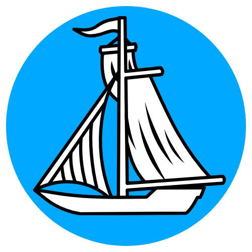

<div align="center">



# havn

**A harbor for your localhost.**

[](https://www.npmjs.com/package/@haseeb-xd/havn)
[](https://nodejs.org)
[](./LICENSE)
[]()

Instantly see every service running on your machine — Redis, Postgres, Kafka, Spring Boot, Next.js, Docker and 40+ more

</div>

```
npm install -g @haseeb-xd/havn@latest && havn
```

Opens at **http://localhost:1111**

---

## Features

- **Zero config** — run one command, everything is detected automatically
- **OS-first discovery** — finds services on *any* port, not just well-known ones
- **40+ service fingerprints** — databases, queues, frameworks, monitoring, AI runtimes
- **Live updates** — WebSocket push every few seconds (configurable), no polling
- **Pause / Watch** — freeze the dashboard while you inspect; resume with one click
- **Insights panel** — warns about missing databases, exposed Docker API, and more
- **Cross-platform** — macOS, Linux, and Windows

---

## Install

```bash
npm install -g @haseeb-xd/havn
```

**Requirements:** Node.js ≥ 16

---

## Usage

```bash
havn                      # start dashboard on port 1111, opens browser
havn start                # same as above
havn start --port 2222    # custom port
havn start --no-open      # start without opening the browser
havn stop                 # stop a running instance
havn status               # check if havn is running
havn --version            # print version
havn --help               # show all options
```

---

## Dashboard

| Element | Description |
|---|---|
| **Live badge** | Green while scanning, yellow when paused |
| **⏸ Pause / ▶ Watch** | Stop auto-scan so the view stays still |
| **↻ Rescan** | Trigger an immediate scan |
| **Interval selector** | Change auto-scan frequency: 2s · 4s · 10s · 30s · 60s |
| **Filter tabs** | Filter by Apps · Databases · Cache · Queue · Monitoring · Infra · AI |
| **Insights** | Smart alerts (no DB detected, Ollama running, Docker API exposed, etc.) |
| **Service History** | Sparkline of port count over time |

---

## What gets detected

### Databases
| Service | Port |
|---|---|
| PostgreSQL | 5432 |
| MySQL | 3306 |
| MongoDB | 27017 |
| Redis | 6379 |
| Elasticsearch | 9200 |
| CouchDB | 5984 |
| Neo4j | 7474 |
| Cassandra | 9042 |
| ClickHouse | 8123 |
| CockroachDB | 26257 |
| Memcached | 11211 |
| SQL Server | 1433 |
| Oracle DB | 1521 |

### Message queues & infra
| Service | Port |
|---|---|
| Kafka | 9092 |
| RabbitMQ | 5672 + 15672 |
| Zookeeper | 2181 |
| Docker API | 2375 |
| HashiCorp Vault | 8200 |
| Consul | 8500 |
| etcd | 2379 |

### Monitoring & observability
| Service | Port |
|---|---|
| Prometheus | 9090 |
| Grafana / Loki | 3100 |
| Jaeger UI | 16686 |
| Zipkin | 9411 |

### App frameworks (detected from HTTP headers + filesystem)
Express · Spring Boot · Next.js · Vite · Angular · SvelteKit · Remix · Astro · Django · FastAPI · Rails · Laravel · Phoenix · Go · Rust (Axum / Actix) · Bun · Deno

### AI runtimes
| Service | Port |
|---|---|
| Ollama | 11434 |

### Unknown services
Process name (from `lsof` / `tasklist`) + page `<title>` extracted from the first 4 KB of the HTTP response.

---

## How it works

```
┌─────────────────────────────────────────────────────────────────┐
│  1. getProcessMap()     one lsof / netstat call  →  port→PID   │
│  2. union with SCAN_PORTS  →  deduplicated port list            │
│  3. TCP-verify all ports in parallel  (150 ms timeout)          │
│  4. filter system / non-dev processes                           │
│  5. enrich every port in parallel:                              │
│       • HTTP fingerprint (headers + title, follow 1 redirect)   │
│       • filesystem detect (package.json, pom.xml, go.mod …)     │
│       • health check (Redis PING, Postgres handshake)           │
│  6. WebSocket broadcast → dashboard                             │
└─────────────────────────────────────────────────────────────────┘
```

---

## Performance

| Step | Typical time |
|---|---|
| OS process map | 80–200 ms (single `lsof` / `netstat` call) |
| TCP port scan (100+ ports, parallel) | ~150 ms |
| HTTP fingerprinting (per port, parallel) | ≤ 900 ms cap |
| Filesystem detection | < 10 ms |
| **Total — first scan** | ~800–900 ms |
| **Total — subsequent scans** | ~300–600 ms |

Memory footprint: ~55 MB RSS.

---

## Project structure

```
havn/
├── bin/
│   └── havn.js        ← CLI entry (start / stop / status)
├── src/
│   ├── server.js      ← Express + WebSocket server, REST API
│   └── scanner.js     ← Port scanner, service fingerprinting
├── public/
│   └── index.html     ← Dashboard UI (single file, no build step)
└── package.json
```

---

## API

havn exposes a small REST + WebSocket API on the same port as the dashboard.

| Method | Path | Description |
|---|---|---|
| `GET` | `/api/state` | Full snapshot: services, insights, history, scan stats |
| `POST` | `/api/scan` | Trigger an immediate scan |
| `POST` | `/api/pause` | Pause auto-scan |
| `POST` | `/api/resume` | Resume auto-scan |
| `POST` | `/api/interval` | Change interval `{ "ms": 10000 }` (1000–300000) |
| `WS` | `/` | Receives `init` on connect, `update` every interval, `status` on config change |

---

## License

MIT © 2024
